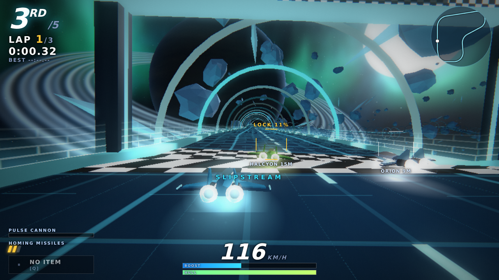

# NOVA CIRCUIT — Anti-Gravity Combat Racing

Fast-paced anti-gravity racing with light, Ace-Combat-style combat. Boost through
loops and corkscrews, lock homing missiles onto rivals, grab power-ups, and win the
four-round championship — solo, split-screen or online.

Play: `npm start` → http://localhost:5173/games/nova-circuit/ (or from the Arena portal).

## Modes
- **Championship** – 4 circuits, points (12/9/7/5/3/2/1), standings, progress saved.
- **Quick Race** – any circuit, 1–5 laps, 0–5 AI rivals, 4 difficulties, weapons on/off.
- **Time Trial** – solo, personal-best lap / race times saved in the Hangar.
- **Local 2-Player** – top/bottom split screen (WASD + arrows), AI fill optional.
- **Online** – rooms of up to 6 pilots (4-letter code / share link). Needs `node server.js`
  (the relay lives in `relay.cjs`); without it the screen explains that online is unavailable.

## Circuits
Frostline Run (ice belt, easy) · Helios Furnace (giant loop around a red giant) ·
Nebula Corkscrew (barrel-roll tube) · Station Zero Trench (double loop through a wreck field).

## Flying
| | Keys | Pad |
|---|---|---|
| Steer | A/D or ←/→ | left stick |
| Boost | Shift / B | A / B |
| Pulse cannon | Space / J | RT |
| Homing missile | E / K | X |
| Item | Q / C | Y |
| Barrel-roll dodge | double-tap A/D | LB / RB |
| Climb / brake | W / S | D-pad / LT |
| Pause / camera | Esc or P / V | Start |

Hold boost as the countdown ends for a **perfect launch** (too early floods the engine).
Boost drains energy; refill with boost pads, energy cells, takedowns and slipstreaming.
Touch controls appear automatically on touch devices.

## Code map
| Path | Purpose |
|---|---|
| `src/track.js`, `layouts.js`, `solved.js`, `trackdefs.js` | Turtle-driven track builder (closed Catmull-Rom spline, parallel-transport frames, banking). `solved.js` is generated by `tools/solve-track.mjs` so loops close exactly. |
| `src/sim.js` | Pure, deterministic race simulation in track-space (dist / lateral / height): physics, AI, weapons, pickups, ranks. |
| `src/world.js`, `shipmodel.js`, `fx.js`, `renderer.js` | three.js scene, procedural ships, particles + bloom/aberration/radial-blur post chain, chase / nose / side / heli cameras. |
| `src/hud.js`, `input.js`, `audio.js`, `preview.js` | DOM HUD (per viewport), keyboard/pad/touch input, WebAudio SFX + generative music, hangar 3D viewer. |
| `src/net.js`, `netgame.js`, `relay.cjs` | Online: each client simulates its own ship and sends ~15 Hz state + combat events through a tiny SSE/POST room relay; others are smoothed ghosts. |
| `src/save.js` | localStorage (settings, records, career, championship). |
| `tests/` | `node --test games/nova-circuit/tests/*.test.mjs` |
| `tools/` | `dev.html` (renderer harness), `track-preview.html`, `track-info.mjs`, `solve-track.mjs` |

Quality auto-scales (render resolution, bloom, MSAA) when the frame rate drops;
override it in Settings. Add `?q=0|1|2` to force a level.
